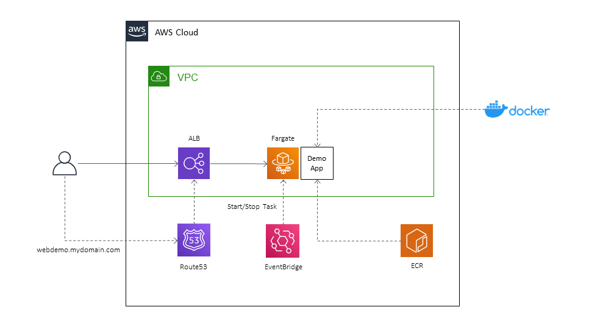

# AWS CDK Fargate and ALB Demo

This Typescript CDK project creates demo web apps on Fargate with an Application Load Balancer.

A more detailed explanation is available [in this Medium article](https://markilott.medium.com/fargate-web-demo-using-cdk-d7ba12a0d166).

&nbsp;

The ALB uses a custom hostname and certificate for HTTPS access.

There are two demo docker apps included, and the Wordpress image from Docker Hub. You can easily modify to use different containers.

Also includes a basic schedule demo, which you can use to optionally start and stop the Fargate tasks.

This Readme assumes you already have an understanding of CDK deployments.

You can deploy the stacks using CDK Deploy.

&nbsp;

## Requirements

Container:
- If using local Docker files then Docker Desktop is required for deployment
- If using an image from Docker Hub then it must include a running web server

Custom hostname:
- A Route53 domain in the same Account is required
- If using an existing ACM Certificate it must be a wildcard or match the hostname.domain that you specify, and be in the same Account and Region.

VPC:
- If using a custom VPC it must include public subnets
- If you don't specify a custom VPC the AWS default VPC will be used

&nbsp;

## Setup

Assuming you have the AWS CLI and CDK installed and configured already...

Setup the project:
- Clone the repo
- run `npm install`
- Update the `config/index.ts` file with your own environment details and preferences

&nbsp;

## Options

- `vpcId` - leave blank to use the default VPC, or enter your own VPC Id.
- `zoneName` and `hostedZoneId` - your custom Route53 domain and hostname for the ALB.
- `certificateArn` - we can create a new certificate for the custom hostname, or you can use an existing certificate.

App options:
- `dockerHubImage` - the URI for the image
- `dockerFileDir` - path to a folder containing a Dockerfile
- `containerPort` - the port for the container web server
- schedule `start` and `stop` - CRON strings for the optional task schedule. The ECS task will be started and stopped on the specified schedules.

&nbsp;

## Deployment

Use CDK to deploy:
`cdk deploy --all`

Note we are using Lookups for the VPC and domain here. You will need to be authenticated to the correct Account in the CLI before you can run `cdk diff` or `cdk synth` the first time. After that the VPC info is saved in cdk.context and you can run offline.

&nbsp;

## Testing and Updating

The ALB hostnames will be Output on deployment and available publicly.

The web servers will be available on the custom hostnames and domain specified. HTTP will redirect to HTTPS.

&nbsp;

## Costs and Cleanup

The ALB will cost ~$18/month. Other components will be within free tiers, although if you leave the Fargate tasks running they can be expensive.

Use `cdk destroy` or delete the CloudFormation stacks.

If you have used local container definititions they will leave images in the default CDK ECR repository that must be manually deleted.
